# 서울 구급·응급 인프라 실태 분석 및 추천 서비스

- **이름 / 학번**: 조예성 / 20241519
- **데이터 출처 / 라이선스**:
  - 소방청 공공데이터포털 (공공누리 1유형)
  - 서울 열린데이터광장 (공공누리 1유형)
  - 기상자료개방포털 ASOS 관측 데이터 (기상청 공공데이터)
  - 중앙응급의료센터 NEMC Mediboard API (비인증 공개 API)

---

## 1. 문제 정의

### 무엇을, 왜 분석하는가

서울에서는 하루 평균 약 1,700건의 구급 출동이 발생하며, 연간 출동 건수는 2017년 54만 건에서 2022년 62만 건으로 6년간 15% 증가했습니다. 이 증가의 구조적 배경에는 **인구 고령화**가 있습니다. 서울 65세 이상 고령 인구는 2022년 기준 약 172만 명(15.8%)으로, 고령자는 낙상·심뇌혈관 질환·만성질환 악화로 인한 구급 이송 비율이 높습니다. 고령화 추세가 지속되면 구급 수요는 더욱 가파르게 증가할 것이며, 인프라 불균형 문제는 더 심각한 위기로 이어질 수 있습니다.

이 가운데 일부 환자는 첫 번째 병원에서 수용을 거부당해 두 번째·세 번째 병원을 찾아야 하는 **2차 이송(뺑뺑이)** 문제가 발생합니다. 2차 이송은 골든타임을 직접 침해하며, 심정지·뇌졸중 환자에게는 생존율 저하로 이어집니다.

본 프로젝트는 다음 두 가지 목적을 가집니다.

1. **실태 분석**: 구급 출동 패턴, 2차 이송 발생 구조, 응급 인프라 분포, 날씨·증상 등 요인 탐색을 통해 서울 구급 체계의 문제 지점을 데이터로 규명합니다.
2. **실용 서비스**: 위치·증상 기반 실시간 응급실 추천과 AI 챗봇을 제공해 분석 인사이트를 구체적 행동으로 연결합니다.

### 풀고 싶은 문제 / 분석 대상

| 분석 질문 | 대응 페이지 |
|---------|-----------|
| 구급 수요는 어떻게 변화해 왔는가 | 출동 트렌드 |
| 2차 이송은 어디서, 왜 발생하는가 | 뺑뺑이 분석 |
| 응급실이 많으면 뺑뺑이가 줄어드는가 | 응급실 상관 |
| 출동 부하는 어느 안전센터에 집중됐는가 | 소방서 현황 |
| 어떤 증상이 어떤 중증도로 이어지는가 | 증상 분석 |
| 날씨(기온·강수·습도·풍속)가 출동 건수에 영향을 주는가 | 날씨 상관 |
| 지금 내 위치에서 받아줄 응급실은 어디인가 | 추천 서비스 |

---
</br>
</br>
</br>

## 2. 데이터 소개 & EDA

### 데이터 목록

| # | 데이터명 | 출처 | 기간 | 규모 |
|---|---------|------|------|------|
| 1 | 소방청 구급출동현황 | 소방청 공공데이터포털 | 2017–2022 | 약 330만 행, 92컬럼 |
| 2 | 소방청 구급상황관리현황 | 소방청 공공데이터포털 | 2019–2023 | 약 730만 행, 26컬럼 |
| 3 | 서울시 소방 구급 출동 현황 | 서울 열린데이터광장 | 2022–2024 | 월별 집계 Excel |
| 4 | 소방청 119신고 전화 유형 | 소방청 공공데이터포털 | 2011–2023 | 26행 (유선/무선 × 13년) |
| 5 | 소방청 서울특별시 주소별 구급출동현황 | 소방청 공공데이터포털 | 2019 | 1,453행 (EDA 전용) |
| 6 | 소방청 전국소방서 좌표현황 | 소방청 공공데이터포털 | 2024.09 기준 | 1,216개소 |
| 7 | 서울시 응급실 위치 정보 | 서울 열린데이터광장 | 현재 기준 | 76개소 |
| 8 | ASOS 서울(108) 시간별 관측 | 기상자료개방포털 | 2019–2024 | 시간별 기온·강수·풍속·습도 |
| 9 | NEMC Mediboard 실시간 응급실 | 중앙응급의료센터 | 실시간 | 서울 51개소 |

### 데이터 규모 및 주요 컬럼

**구급출동현황** (`구급출동_YYYY.csv`)

| 항목 | 내용 |
|------|------|
| 규모 | 연간 약 48–62만 행, 92개 컬럼 |
| 지역 | 서울 전용 (`GRNDS_CTPV_NM` 99.8% 서울) |
| 날짜 | `DCLR_YMD`(일자), `DCLR_MM`(월), `SEASN_NM`(계절) 정상 |
| 시간 컬럼 | `DCLR_TM`, `DCLR_HR`, `DCLR_MN` — **전 연도 100% null** |
| 2차 이송 | `TRANS2_RSN` (비null 약 0.2% = 뺑뺑이 케이스) |
| 이송 병원명 | **컬럼 없음** |
| 기상 컬럼 | `HR_UNIT_ARTMP`(기온), `HR_UNIT_RN`(강수량) 등 포함 |

**구급상황관리현황**

| 항목 | 내용 |
|------|------|
| 규모 | 연간 약 130–173만 행, 26개 컬럼 |
| 지역 | 전국 (서울 약 19%) |
| 주증상 | `MAIN_SYM_NM` (null 57%) |
| 중증도 | `SRIL_CLSF_NM` (null 67%, 비응급·응급·긴급·사망 분류) |

</br>
</br>
</br>
</br>

**ASOS 서울(108) 기상 관측**

- 인코딩: CP949
- 시간별 38개 컬럼 (기온·강수량·풍속·풍향·습도 등)
- 2019~2024 총 6개 파일, 연간 약 8,736~8,760행
- 구급출동 데이터(2017–2022)와 겹치는 구간: **2019~2022년 (1,459일)**

### EDA에서 발견한 사실

**① 연간 출동 건수 추이**

2020년 코로나19 영향으로 47만 건까지 감소한것으로 추정됩니다.
 이후 반등해 2022년 62만 건으로 6개년 최고치를 기록했습니다. 
 2017~2019년 대비 2021~2022년 출동 증가폭이 더 가팔라 구조적 수요 증가가 확인됩니다.

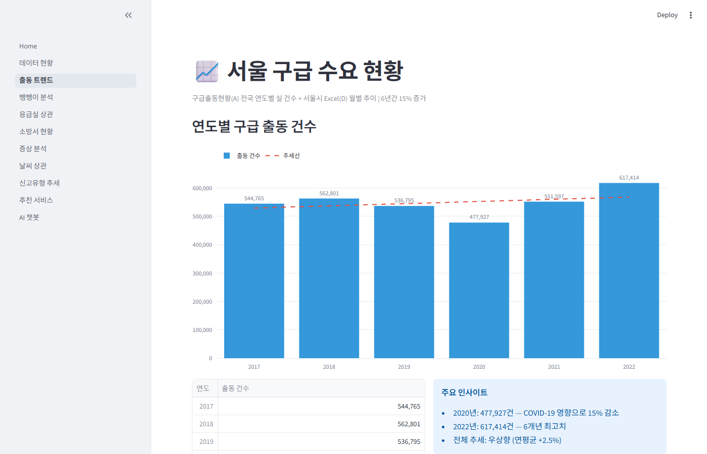

**② 자치구별 2차 이송 발생률 격차**

서울 25개 구 중 서대문구(0.441%)와 강동구(0.077%) 간 약 **5.7배 격차**가 존재합니다. 응급실 수와 2차 이송률 간 Pearson r = -0.182 (p=0.383)로 통계적으로 유의하지 않아, **응급실 수만으로는 뺑뺑이를 설명하기 어렵다**는 결론이 도출됩니다.

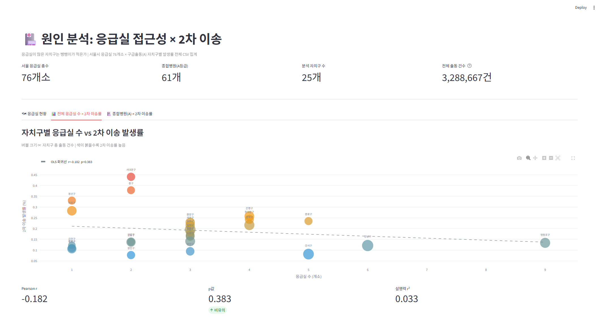

**③ 날씨 상관계수 (ASOS 기반, 1,459일)**

| 변수 | Pearson r | 유의 |
|------|----------|------|
| 기온(°C) | +0.342 | p≈0 ✅ |
| 습도(%) | +0.272 | p≈0 ✅ |
| 강수량(mm) | +0.113 | p≈0 ✅ |
| 풍속(m/s) | -0.077 | p=0.003 ✅ |

기온이 4개의 변수 중 가장 강한 양의 상관을 보이며, 풍속은 약한 음의 상관을 보입니다. 4개 변수 모두 통계적으로 유의합니다.

### 결측·이상치 처리

| 항목 | 처리 방법 |
|------|---------|
| 시간 컬럼 100% null | 이송 소요시간 분석 포기, 출동 건수·패턴 분석으로 전환 |
| 이송 병원명 없음 | 실시간 API(NEMC)로 병원 정보 보완 |
| `MAIN_SYM_NM` null 57% | null 제외 후 유효 데이터만 분석 |
| `SRIL_CLSF_NM` null 67% | 동일 |
| ASOS 기상 결측 | `pd.to_datetime(errors='coerce')` 후 dropna |

---

</br>
</br>
</br>
</br>

## 3. 특성 엔지니어링

### 새로 만든 특성

| 특성 | 원천 | 근거 |
|------|------|------|
| **2차 이송 발생률** (%) | `TRANS2_RSN` 비null 비율 | 자치구별 뺑뺑이 심각도 정량화 |
| **추천 스코어** | 거리 × 분류가중치 × 병상팩터 × 증상수용팩터 | 단순 거리 순위 보완; 병상 0개 병원 패널티 부여 |
| **일별 출동 건수** | `DCLR_YMD` 기준 groupby count | 날씨 상관 분석용 시계열 생성 |
| **자치구 추출** | `address` 필드에서 `구` 접미사 파싱 | NEMC API 응답에 행정구역 코드가 없어 주소에서 직접 추출 |
| **병상팩터** | `key_bed_count`를 구간화 | 0개(만실)=2.0, 1–4개=0.9, 5–10개=0.75, 11개+=0.6 |
| **증상수용팩터** | Y코드 `unavailableMessages` 교집합 여부 | 수용 가능=0.5, 수용 불가=2.5, 정보 없음=1.0 |
| **거부 이유 카테고리** | `TRANS2_RSN` 텍스트 키워드 매핑 | '응급실 포화', '진료 불가', '거리·접근성' 등 6범주 |
| **ASOS 일별 집계** | 시간별 → 일별 평균(기온·풍속·습도), 합계(강수량) | 구급출동 일별 건수와 조인하기 위한 시간 단위 통일 |

---

## 4. 모델 / 서비스

### 사용한 방법

본 프로젝트는 ML 지도학습 모델을 사용하지 않습니다. 이는 기획 단계에서 예측했던 핵심 난관이 실현됐기 때문입니다 — **이송 목적지(병원) 컬럼이 구급출동 데이터에 없어** 추천 정답 레이블을 만들 수 없었습니다. 대신 세 가지 방식을 조합합니다.

| 방식 | 적용 부분 |
|------|---------|
| **휴리스틱 스코어링** | 추천 서비스: 거리·병상·증상 기반 가중 공식 |
| **Pearson 상관분석** | 날씨 상관, 응급실-이송률 상관 |
| **LLM Tool Calling** | AI 챗봇: GPT-4o + 14개 함수 도구 |

### 추천 서비스 입력 → 출력 흐름

```
[입력]
  자치구 선택 또는 지도 클릭 → 위도·경도
  증상 선택 (흉통·뇌졸중·외상·소아 등 11종)

         │
         ▼
  NEMC Mediboard API 단일 호출
  (/api/v1/search/handy?emogloca=11)
  → 서울 51개 응급실 실시간 병상 반환

         │
         ▼
  각 병원별 스코어 계산
  score = dist_km × 분류가중치 × 병상팩터 × 증상수용팩터
  (score 낮을수록 우선 추천)

         │
         ▼
[출력]
  TOP-5 응급실 카드 (2×n 그리드)
  - 병원명, 분류, 거리, 예상 도착시간
  - 응급실 일반·소아·음압 병상 도넛 차트 (혼잡/보통/원활)
  - Y코드 기반 증상 수용 여부 표시
  가까운 소방 안전센터 TOP-3 (접힌 상태)
```

### AI 챗봇 입력 → 출력 흐름

```
[사용자 질문 입력]
         │
         ▼
  GPT-4o Tool Calling 루프 (최대 5라운드)
  → AI가 필요한 도구를 선택·호출
         │
    ┌────┴────────────────────────────┐
    │ 분석 조회 도구 (10개)             │
    │ - query_district_transfer_rate  │
    │ - query_seasonal_demand         │
    │ - query_weather_correlation     │
    │ - query_yearly_trend 등         │
    ├─────────────────────────────────┤
    │ 위치 기반 추천 도구 (2개)          │
    │ - recommend_hospitals_nearby    │
    │ - recommend_stations_nearby     │
    ├─────────────────────────────────┤
    │ 실시간 조회 도구 (2개)             │
    │ - get_realtime_er_beds          │
    │ - get_severe_disease_acceptance │
    └─────────────────────────────────┘
         │
         ▼
  st.status로 도구 호출 과정 투명 표시
         │
         ▼
[스트리밍 최종 답변]
```

### 성능 지표 / 결과 해석

추천 서비스는 지도학습 모델이 아니므로 정확도·F1 지표가 없습니다. 대신 다음 기준으로 서비스 품질을 평가합니다.

- **NEMC API 응답 여부**: 실시간 51개소 병상 데이터 정상 수신 확인
- **날씨 상관 유의성**: 4개 변수 모두 p<0.05 (1,459일 기반)
- **뺑뺑이 분석 신뢰성**: 전체 CSV 330만 행 기반 (샘플 아님)

---

## 5. Streamlit 앱

### 실행 방법

```bash
pip install -r requirements.txt
# .env 파일에 키 설정
# OPENAI_API_KEY=sk-...
# EMER_API_KEY=...  (E-Gen, 선택)
streamlit run app/Home.py
```

### 페이지 구성

| # | 페이지 | 핵심 내용 | 주요 컴포넌트 |
|---|--------|---------|-------------|
| Home | 프로젝트 소개 | 분석 동기, 고령화 배경, 4단계 분석 흐름 | 타임라인 HTML, 데이터 출처 표 |
| 1 | 데이터 현황 | 데이터 규모 KPI, 연도별 행 수 | st.metric, bar chart |
| 2 | 출동 트렌드 | 연도별·계절별·시간대별 출동 패턴 | Plotly line/bar, Folium 지도 |
| 3 | 뺑뺑이 분석 | 자치구별 2차 이송률, 거부 이유, 거리 통계 | Plotly bar/scatter, choropleth |
| 4 | 응급실 상관 | 응급실 수 × 2차 이송률 Pearson 상관 | Plotly scatter + 회귀선 |
| 5 | 소방서 현황 | 안전센터별 출동 부하 순위 | Plotly bar, Folium bubble map |
| 6 | 증상 분석 | 주증상 빈도 TOP 20, 중증도 분포 | Plotly bar, heatmap |
| 7 | 날씨 상관 | ASOS 기반 기온·습도·강수·풍속 상관 | Plotly bar, scatter + 회귀선 |
| 8 | 신고유형 추세 | 119 신고 유형 2011–2023 추이 | Plotly area chart |
| 9 | 추천 서비스 | 위치·증상 → 실시간 응급실 TOP-5 | Folium 지도, Plotly 도넛 차트, NEMC API |
| 10 | AI 챗봇 | 분석 Q&A + 실시간 응급실 조회 | st.chat_message, GPT-4o Tool Calling |

</br>
</br>
</br>

### 화면 캡처

**Home — 분석 흐름 타임라인**

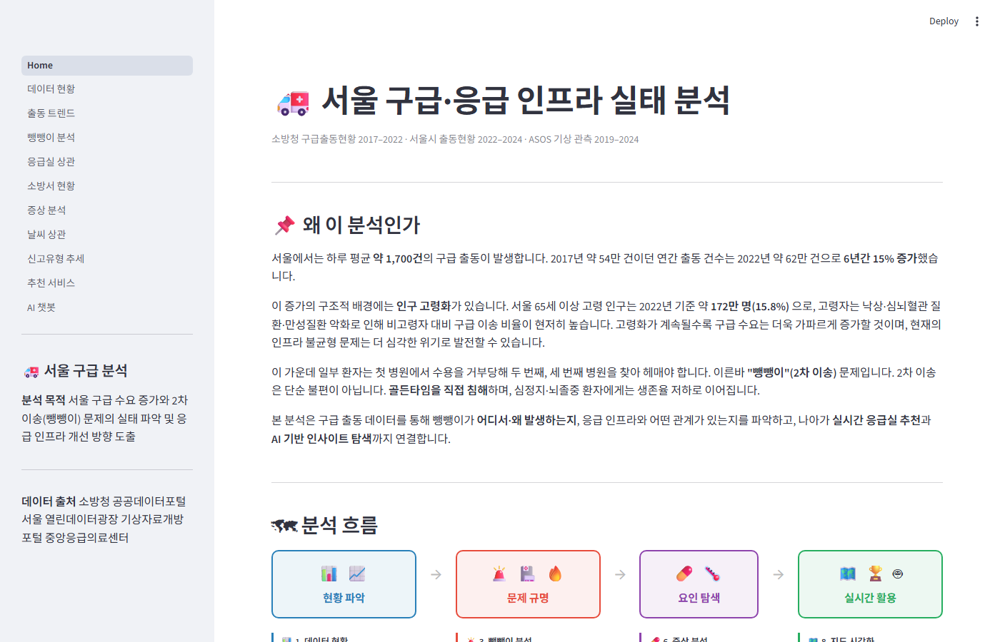

**1. 데이터 현황 — 데이터 규모 KPI**

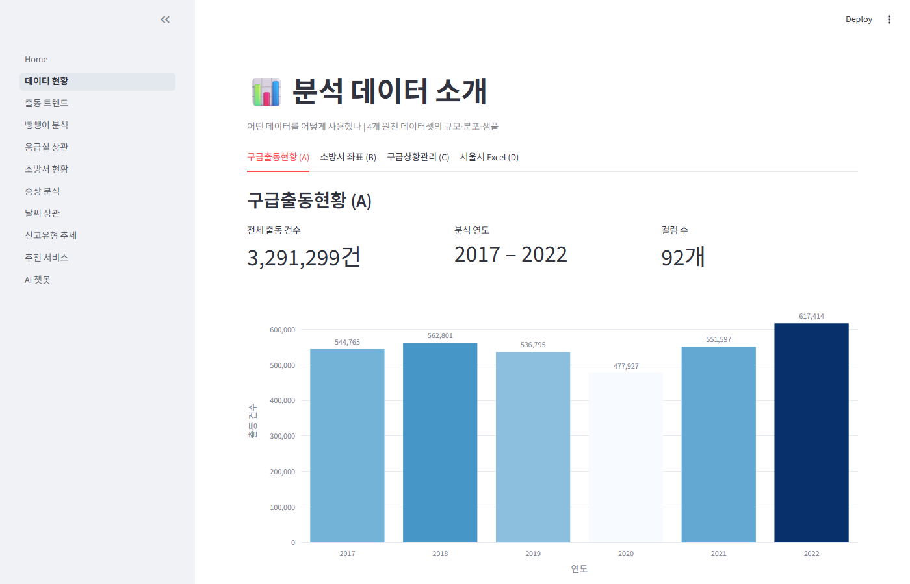

**2. 출동 트렌드 — 연도별 출동 건수 추이**


**3. 뺑뺑이 분석 — 자치구별 2차 이송 발생률**

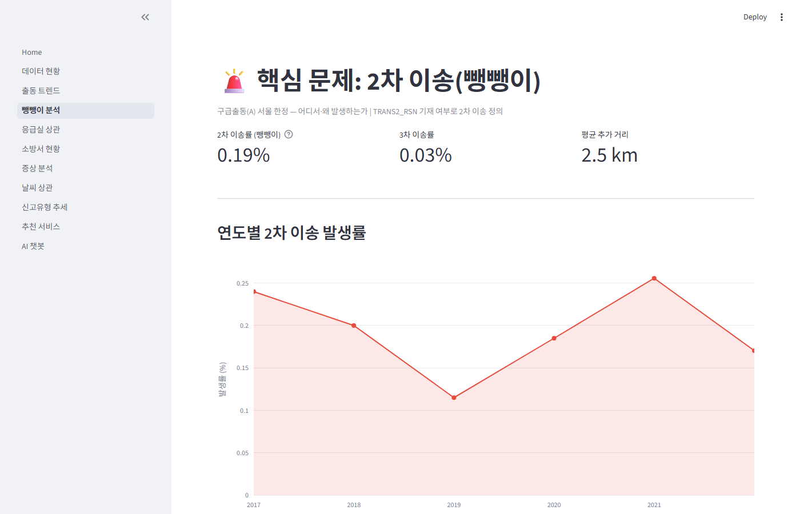

</br>

**4. 응급실 상관 — 응급실 수 × 이송률 산점도**

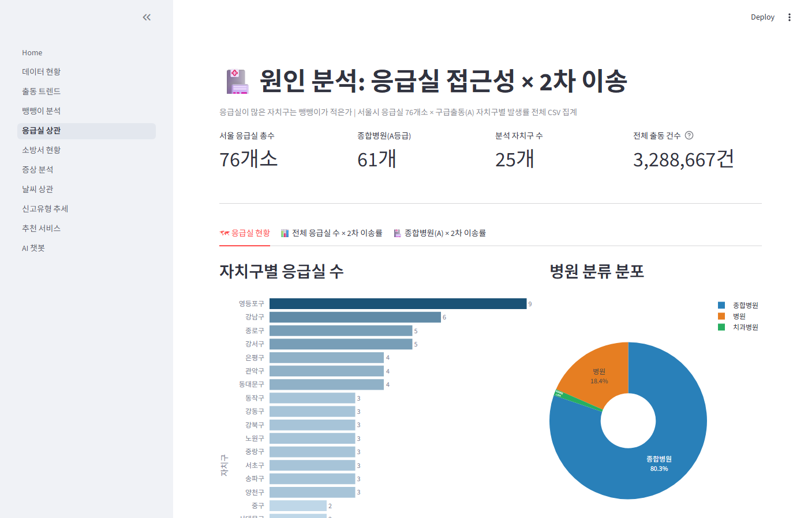

**5. 소방서 현황 — 안전센터별 출동 부하**

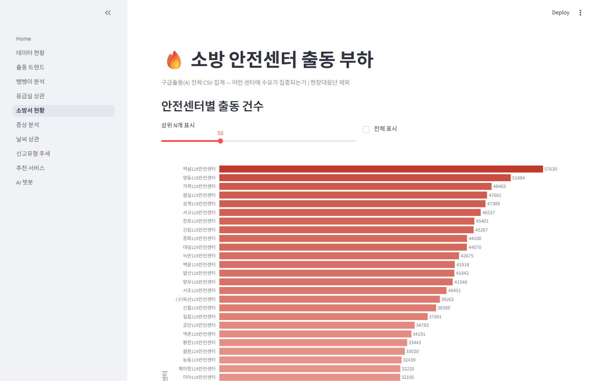

</br>

**6. 증상 분석 — 주증상 TOP 20 빈도**

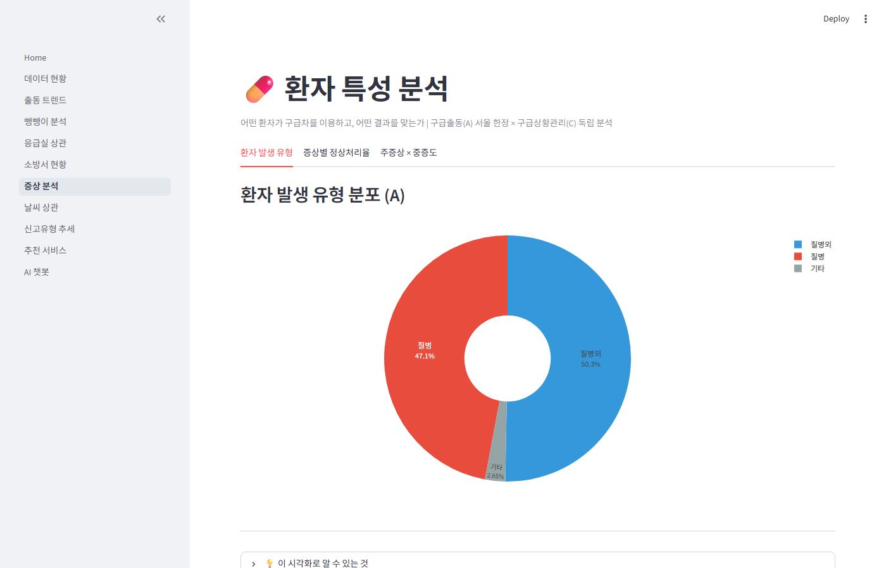

**7. 날씨 상관 — Pearson 상관계수 테이블 및 막대 차트**

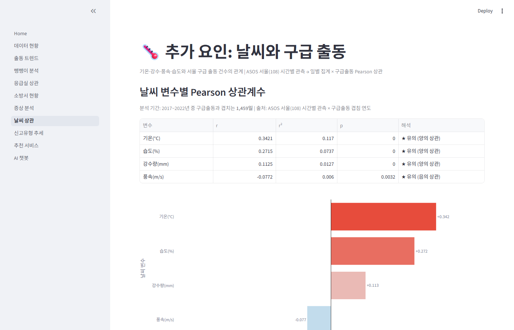

</br>

**8. 신고유형 추세 — 연도별 신고 유형 추이**

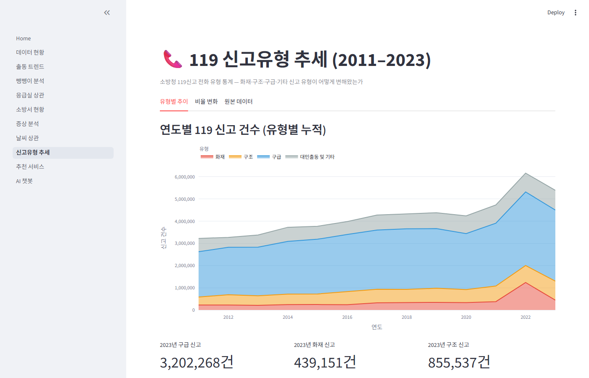

**9. 추천 서비스 — 실시간 응급실 TOP-5 카드**

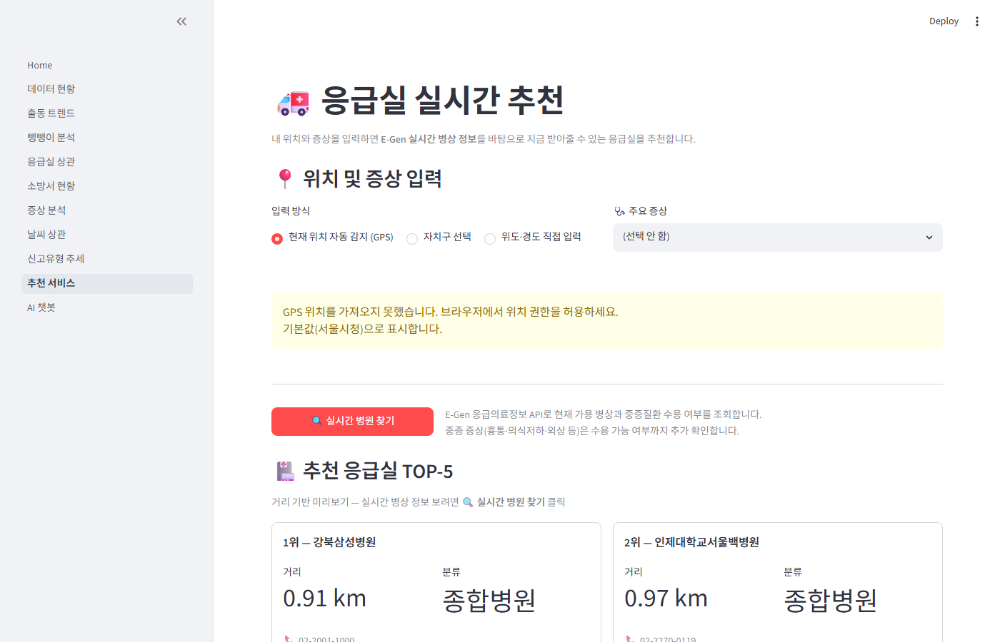

</br>

**10. AI 챗봇 — 분석 Q&A 및 Tool Calling 연동**

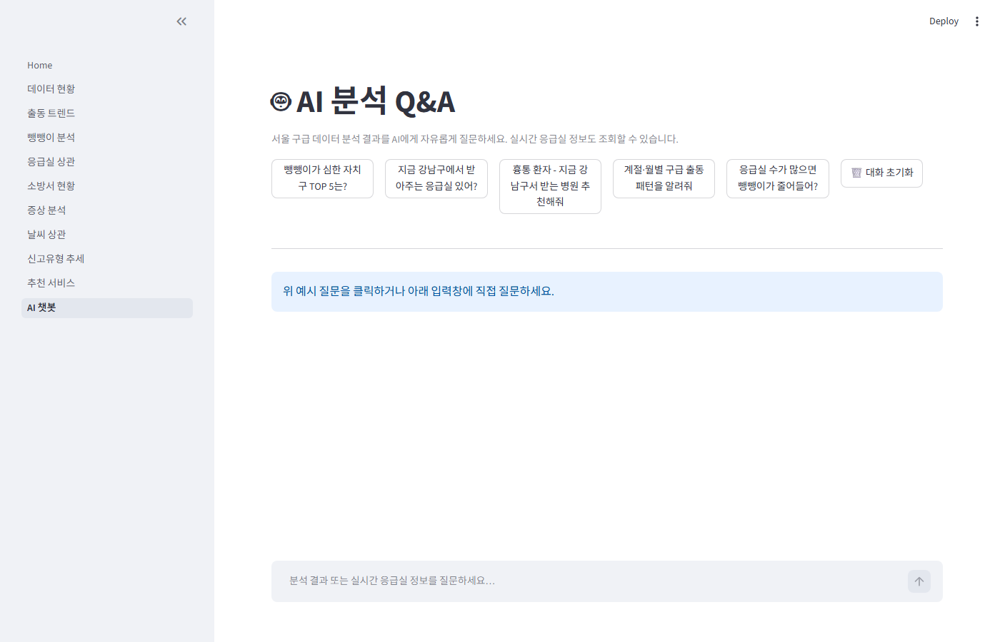

---

## 6. 결론 & 한계

### 알게 된 것

1. **구급 수요 구조적 증가**: 2017→2022년 15% 증가, 2020년 코로나 감소 후 빠른 반등. 고령화와 결합해 장기 증가 추세가 확인됩니다.

2. **뺑뺑이 지역 불균형**: 서대문구(0.441%) vs 강동구(0.077%) 5.7배 격차. 응급실 수는 유의미한 설명 변수가 아닙니다(r=-0.182, p=0.383). 거부 이유 1위는 진료 불가(전문의 부재), 2위는 응급실 포화입니다.

3. **날씨 효과 유의**: 기온(r=+0.342), 습도(r=+0.272), 강수(r=+0.113), 풍속(r=-0.077) — 4개 변수 모두 p<0.05. 단, r²≤0.12로 설명력은 낮아 날씨는 보조 변수입니다.

4. **NEMC API의 우월성**: E-Gen 대비 단일 호출로 서울 51개소 반환, GPS 좌표 직접 제공, 인증 불필요 → 추천 서비스 구현 효율이 대폭 향상됐습니다.

5. **AI Tool Calling 확장성**: 정적 요약 주입 방식 대비 14개 도구를 통해 훨씬 정확한 수치와 실시간 정보를 제공합니다. "지금 강남구에서 흉통 받는 병원"처럼 분석 + 실시간을 결합한 질문에 답할 수 있습니다.

### 한계 및 향후 과제

| 한계 | 내용 | 향후 개선 방향 |
|------|------|-------------|
| **이송 소요시간 분석 불가** | 구급출동 시간 컬럼 전 연도 100% null | NEMC/소방청 개선 데이터 확보 시 재분석 |
| **추천 라벨 없음** | 실제 최적 병원 정답 데이터 부재 → 지도학습 불가 | 이송 결과 데이터 연계 시 ML 모델 적용 가능 |
| **기상 데이터 기간 한계** | ASOS 2019~2024, 구급출동 2017~2022 → 겹침 4년(1,459일) | 2017~2018년 기상 데이터 추가 확보 시 전체 기간 분석 |
| **NEMC API 안정성** | 공개 비인증 API로 서비스 중단 시 fallback 필요 | E-Gen API를 보조 fallback으로 유지 |
| **샘플 기반 앱 일부** | Streamlit 앱은 연 20,000행 샘플 사용 (analytics JSON 제외) | `generate_analytics.py` 사전 실행으로 전체 데이터 활용 가능 |

---

## 부록: 기획서 대비 변경 사항

기획서(2026-05-29 작성) 대비 실제 구현에서 달라진 사항을 사실 그대로 정리합니다.

### 1. 페이지 구조 확대 (6 → 10페이지)

| 기획서 | 실제 구현 | 변경 사유 |
|--------|---------|---------|
| 1_추천_서비스 | 9_추천_서비스 (순서 변경) | 분석 결과를 먼저 보여준 뒤 서비스로 연결하는 흐름으로 재설계 |
| 2_출동현황_분석 | 2_출동_트렌드 | 명칭 변경 |
| 3_뺑뺑이_분석 | 3_뺑뺑이_분석 | 동일 |
| 4_증상별_분석 | 6_증상_분석 | 순서 변경 |
| 5_신고유형_추세 | 8_신고유형_추세 | 순서 변경 |
| 6_AI_챗봇 | 10_AI_챗봇 | 순서 변경 |
| *(없음)* | 1_데이터_현황 | **신규 추가**: 데이터 규모·출처 KPI 페이지 |
| *(없음)* | 4_응급실_상관 | **신규 추가**: 응급실 수 × 뺑뺑이율 상관분석 |
| *(없음)* | 5_소방서_현황 | **신규 추가**: 안전센터별 출동 부하 분석 |
| *(없음)* | 7_날씨_상관 | **신규 추가**: ASOS 기상 × 출동 건수 상관분석 |

### 2. 실시간 API 교체: E-Gen → NEMC Mediboard

기획서에는 E-Gen 응급의료정보 API(오퍼레이션별 XML 응답, API 키 필요)를 핵심 실시간 데이터 소스로 명시했습니다. 실제 구현 과정에서 NEMC Mediboard API(`mediboard.nemc.or.kr/api/v1/search/handy`)를 발견해 교체했습니다.

| 항목 | E-Gen (기획서) | NEMC Mediboard (실제) |
|------|--------------|----------------------|
| 인증 | API 키 필수 | **불필요** |
| 호출 횟수 | 자치구당 1회 (최대 15회) | **단일 호출 (서울 전체)** |
| 좌표 제공 | 없음 (이름 매핑 필요) | **GPS 직접 포함** |
| 병상 총수 | 없음 (가용만) | **가용 + 총수 모두 제공** |
| 수용 불가 | MKioskTy 코드 | **Y코드 (`unavailableMessages`)** |

E-Gen은 AI 챗봇 도구 스키마에 정의만 유지하고 실제 호출은 NEMC로 대체했습니다.

### 3. 데이터 추가

기획서에 없던 두 가지 데이터가 추가됐습니다.

- **ASOS 서울(108) 시간별 기상 관측** (기상자료개방포털): 날씨 상관 분석 페이지와 AI 챗봇 `query_weather_correlation` 도구에 활용했습니다. 구급출동 CSV 내장 기상 컬럼(`HR_UNIT_*`) 대비 더 정확한 외부 관측 데이터입니다.
- **서울시 응급실 위치 정보**: 응급실 상관 분석 및 추천 서비스 fallback 데이터로 활용했습니다.

### 4. AI 챗봇 구현 방식 변경

| 항목 | 기획서 | 실제 구현 |
|------|-------|---------|
| 방식 | 정적 분석 요약 텍스트를 시스템 프롬프트에 주입 | **OpenAI Function Calling (Tool Calling)** |
| 도구 수 | — | 14개 (분석 조회 10 + 위치 추천 2 + 실시간 2) |
| 수치 정확도 | 요약본 한계 (25개 구·50개 센터 정도만 커버) | **전체 데이터 JSON에서 정확한 수치 직접 조회** |
| 실시간 연동 | 없음 | NEMC API 실시간 조회 가능 |

### 5. ML 모델 미적용

기획서에 "ML(거리·병상·증상 기반 점수화 및 랭킹 알고리즘)"을 언급했으나, 기획 단계에서 예상했던 난관대로 **이송 목적지(병원) 레이블이 없어 지도학습 모델 학습이 불가능**했습니다. 최종 구현은 수식 기반 휴리스틱 스코어링으로 대체했으며, 통계적 방법(Pearson 상관)을 분석에 활용했습니다.

### 6. Parquet 캐시 → analytics JSON

기획서에 `data/processed/` Parquet 저장 후 Streamlit이 읽는 방식을 계획했으나, 실제로는 `scripts/generate_analytics.py`가 전체 CSV를 1회 처리해 `data/analytics/*.json` 12개 파일을 생성하는 방식으로 구현됐습니다. Streamlit은 JSON을 직접 읽어 도구 호출에 활용합니다.
